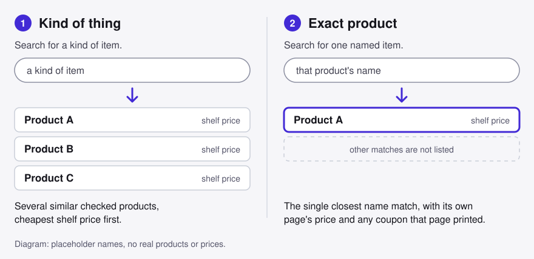

<p align="center">
  <a href="https://thewyattbrocato.github.io/ai-deal-finder/"></a>
</p>

# AI Deal Finder

### **[Open the live tool: thewyattbrocato.github.io/ai-deal-finder →](https://thewyattbrocato.github.io/ai-deal-finder/)**

Nothing to download or install. It runs in your browser. The page loads its
styling from a CDN, so you need an internet connection.

Deal Finder searches a set of store product pages that were opened and read
ahead of time. For each product it shows the shelf price, a plain decision, and
a coupon code only when that product's own page printed one. It never guesses a
price and never fills in what a page did not say.

<p align="center">
  
</p>

## Use it in four steps

1. **Pick how to search.**
   - **Kind of thing** (the default) lists several similar checked products,
     cheapest shelf price first, twelve at a time with a *Show more matches*
     button. Type something like `coffee beans`.
   - **Exact product** returns the one closest name match. Type a name such as
     `super crema`.

   

2. **Narrow it with the guide, if you want to.** The guide is optional and the
   results stay visible while you use it. It asks only what the pages in your
   results actually state: what kind, coffee bag size, shoe or clothing size,
   subscribe, free shipping, what matters most, and whether to show only
   products with a printed coupon. A question you can't answer from the pages
   is not asked. Each answer can be changed at any time, and *Reset* shows
   everything again.
3. **Read the cards.** Each card has the product, its shelf price, a decision
   with a *See at the store* link, any coupon, and what the page stated about
   size, shipping and subscribe. A *Why it is here* line says why a product is
   listed, and *Hidden by your answers* lists what the guide removed and why.
4. **Go to the store and recheck.** The price was true when the page was
   checked. The card says to recheck at checkout, and the store's own page has
   the final say.

<p align="center">
  
</p>

On a phone the same page works at narrow width:

<p align="center">
  
</p>

## What the evidence rules mean

- **A coupon is shown only when that product's own page printed it.** The card
  gives the code, the page, and the time it was seen. If the page printed none,
  the card says *No coupon on this page*.
- **A seen code is never a lower price.** The code is listed beside the price
  and marked *seen, not tried*. Nothing is added to a bag and no code is
  tested, so the price you see does not include it.
- **The shelf price stays the shelf price.** Products are ordered and compared
  by what the page showed, with no savings maths added. A *was* price appears
  only when the page marked one.
- **Unknown stays unknown.** If a page did not show size, shipping, tax or a
  subscribe price, the card says so instead of filling it in. A product that
  does not list the size you picked is hidden, not guessed.


The page covers only products that were checked and stored in this repo
(`demo/evidence/`). It is not a live search of the web: a product that is not
there cannot be found, and prices may have changed since the check. The page
is rebuilt offline from that stored evidence with `python3 demo/build.py`.

## Use it as an agent skill

For one evidence-backed `buy`, `wait`, `verify`, or `abstain` purchase decision,
`SKILL.md` is the operating contract. The Python runtime owns deterministic
validation, landed-cost arithmetic, consent gates, and optional Jev
composition. It does not browse, mutate carts, log in, or purchase.

The acceptance corpus is still authored draft evidence. Building the skill does
not mark any gate in `VALIDATION_RECORD.md` passed or establish effectiveness.

### Run

Python 3.11+ is the only local requirement.

```sh
python3 -m unittest discover -v
scripts/deal-finder --help
scripts/deal-finder evaluate evidence.json
```

`evaluate` defaults to the deterministic fail-closed path and returns `verify`
when no judgment is available. To execute the accepted Jev Choice/Score/Noul
layer, set the server-side `TYPESAFE_API_KEY` and add `--live-jev`. The pinned
model is `jev-1.13.0`. A 429/529 is retried with bounded backoff; outages degrade
to `verify`; 401 and 422 halt for configuration/developer review. Key-dependent
validation is listed in `KEYED_VALIDATION.md` and is not claimed by local tests.

### Evidence JSON

The top level is the `State` object in `JUDGMENT_ENGINE.md`: `request`,
`candidates`, `consent`, and `history`. Each candidate must include identity and
provenance fields plus deterministic cost inputs:

```json
{
  "request": {
    "item": "Exact product",
    "must_have_attributes": ["attribute"],
    "may_vary": ["color"],
    "region": "US",
    "currency": "USD",
    "mode": "browsing",
    "category": "general"
  },
  "candidates": [{
    "id": "C1",
    "variant": "exact variant",
    "quantity_terms": "1 unit",
    "condition": "new",
    "bundle": "none",
    "seller": "Merchant",
    "fulfilled_by": "Merchant",
    "region": "US",
    "source": "https://merchant.example/item",
    "observed_at": "2026-09-19T12:00:00Z",
    "evidence_state": "observed-now",
    "availability": "in-stock",
    "is_substitute": false,
    "exact_match": true,
    "item_price": "20.00",
    "immediate_discount": "0",
    "shipping": "0",
    "mandatory_fees": "0",
    "tax": null,
    "flags": []
  }],
  "consent": {"status": "absent"},
  "history": {}
}
```

Costs are decimal strings, `null` for unknown, or `{"min":"0","max":"5"}`
for a bounded range. Ranking follows `LANDED_COST.md`. `immediate_discount`
tied to a coupon is accepted only when coupon status is
`applied-in-anonymous-cart` or `shopper-confirmed-at-checkout`.

### Cart authorization

The CLI persists explicit consent, but performs no browser action. Consent
grant records the merchant and coupon attempt the grant covers. `cart-check`
requires a run JSON naming `merchant`, `attempt`, `session_id`, `browser_tools`,
`merchant_rules` (`allow` only), `logged_out`, `cleanup_guaranteed`,
`scarce_inventory`, `attempt_budget` (1-3), and `attempts_planned`. Consent for
one merchant or attempt cannot authorize a different merchant's cart test. Any
missing, false, ambiguous, or revoked prerequisite returns `research-only`.

## Policy and acceptance documents

- Frozen product vision: `VISION.md` (do not edit; SHA-256
  `22a01c3cee76da7092e1a912c1035c6da0c05b9b97b7884a56816fe47a642cae`).
- Author-approved baseline: `EVIDENCE.md`.
- Acceptance contract (reviewer isolation, severity, thresholds): `ACCEPTANCE.md`.
- Verdict meanings and downgrade rules: `DECISION_TABLE.md`.
- Prospective real-user study: `USER_VALIDATION_PLAN.md`.
- Consent and cart-action accountability: `CONSENT.md`.
- Discovery and substitute bounds: `DISCOVERY.md`.
- Unknown-cost behavior: `LANDED_COST.md`.
- Draft fixture corpus (21 cases, needs independent relabeling): `FIXTURES.json`.
- Judgment engine spec and Jev Choice/Score/Noul binding: `JUDGMENT_ENGINE.md`.
- Gate-by-gate evidence record (all gates not run/blocked): `VALIDATION_RECORD.md`.
- Key-dependent Jev validation still required: `KEYED_VALIDATION.md`.
- Build assumptions and captain decision batch: `ASSUMPTIONS.md`.
- Real-browser check of the engine against live-observed pages: `LIVE_VERIFICATION.md`.
