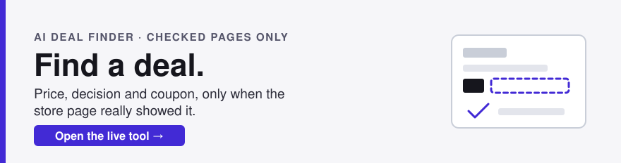
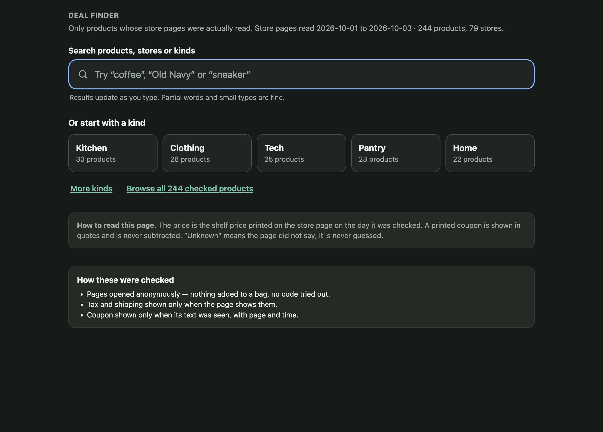
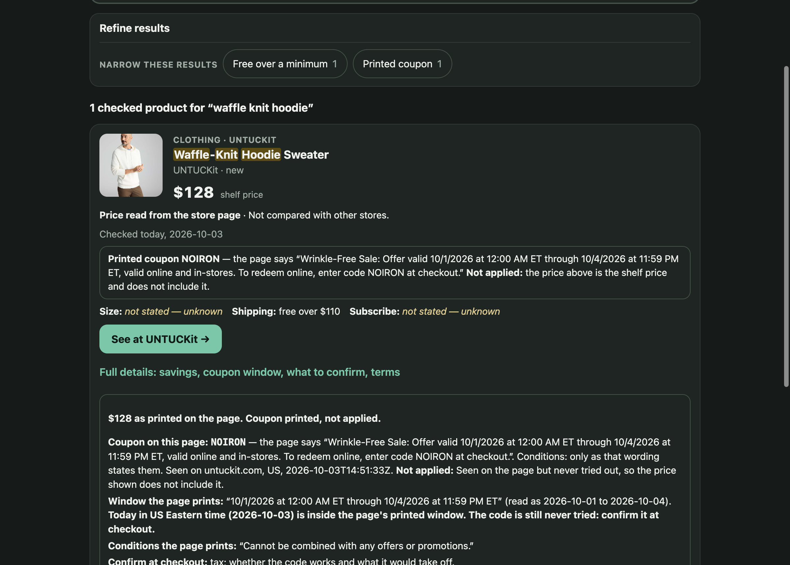
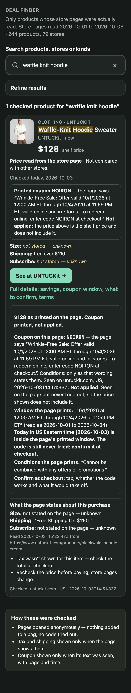
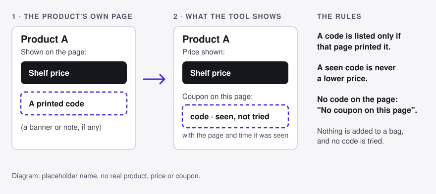

<p align="center">
  <a href="https://thewyattbrocato.github.io/ai-deal-finder/"></a>
</p>

# AI Deal Finder

### **[Open the live tool: thewyattbrocato.github.io/ai-deal-finder →](https://thewyattbrocato.github.io/ai-deal-finder/)**

Nothing to download or install. It runs in your browser.

Deal Finder searches a set of store product pages that were opened and read
ahead of time. For each product it shows the shelf price, and a coupon code only
when that product's own page printed one. It never guesses a
price and never fills in what a page did not say.

<p align="center">
  
</p>

## Use it in four steps

1. **Type what you want.** The search box is focused when the page opens.
   Results appear as you type, with no Search button. Type a product, a store or
   a kind, such as `coffee`, `Old Navy` or `sneaker`. Partial words work, and so
   do small typos: when a word matched only as a close spelling of a word in the
   checked pages, the page says so and names the spellings it used. As you type,
   suggestions list kinds, stores and products (with their shelf price); you can
   also start from a kind button or *Browse all checked products*. By default
   results are ordered by best word match; a sort control switches to price, low
   to high or high to low. Results are shown 24 at a time with a *Show more*
   button.
2. **Narrow it, if you want to.** *Refine results* is optional and appears above
   the results. Its chips (kind, a size the pages list, free shipping, subscribe,
   printed coupon) each show how many of the current results they would keep, and
   only chips that apply to your results are offered. If a chip would leave
   nothing, or no product matches, the page says so and offers *Drop* buttons
   that show what would be left, plus *Clear all choices*. Nothing is shown that
   doesn't fit, and nothing is guessed. Products whose page doesn't state a
   fact you narrowed by (for example size or shipping) are not counted in the
   results. A line such as "3 more products don't state size on the page" lists
   them separately behind *Show them*.
3. **Read the card.** Each card is compact: the product's photo when one was
   captured, its name, store, shelf price, the line *Price read from the store
   page* (with *Not compared with other stores*), when it was checked, any printed
   coupon with the page's own words, and what the page stated about size,
   shipping and subscribe, plus a *See at the store* link. *Full details* opens on
   the same card, with the savings line, the coupon's printed date window,
   conditions the page printed, *Confirm at checkout* items and the terms read.
4. **Go to the store and recheck.** The price was true when the page was
   checked. The card says to recheck at checkout, and the store's own page has
   the final say.

<p align="center">
  
</p>

<p align="center"><sub>Real, unedited capture of the live tool on 2026-10-03. The coupon window on that card ends 2026-10-04, so a later visit shows the card's own passed/not-passed line instead.</sub></p>

A result card shows the shelf price exactly as the store page printed it, and how
old the check is ("Checked today", or "Checked 2 days ago"). If the page printed a
coupon, the card quotes the page's own words and says the code was printed, not
applied, so the price never includes it. It also quotes the coupon's printed date
window and says whether today, in US Eastern time, is inside it or has passed, or
that the text states no clear window. Shipping that needs a membership is not
counted as free: the card says the check was not signed in. Whatever the page did
not show, such as tax or whether a code works, is listed on a *Confirm at
checkout* line in *Full details*.

On a phone the same page works at narrow width:

<p align="center">
  
</p>

## What the evidence rules mean

- **A coupon is shown only when that product's own page printed it.** The card
  gives the code, the page, and the time it was seen. If the page printed none,
  the card says *No coupon on this page*.
- **A seen code is never a lower price.** The code is listed beside the price
  and marked *seen, not tried*. Nothing is added to a bag and no code is
  tested, so the price you see does not include it.
- **The shelf price stays the shelf price.** Products are ordered and compared
  by what the page showed, with no savings maths added. A *was* price appears
  only when the page marked one.
- **Unknown stays unknown.** If a page did not show size, shipping, tax or a
  subscribe price, the card says so instead of filling it in. A product that
  does not list the size you picked is hidden, not guessed.



The page covers only products that were checked and stored in this repo
(`demo/evidence/`). It is not a live search of the web: a product that is not
there cannot be found, and prices may have changed since the check. The page is
rebuilt offline from that stored evidence with `python3 demo/build.py`.

What the numbers mean, as measured on 2026-10-03 at commit `2700844` (they will
drift as the catalog grows, so each comes with the command that recomputes it).
Run the commands from the repo root; they read the built page, `demo/index.html`:

```sh
python3 - <<'PY'
import json, re, urllib.parse
h = open("demo/index.html").read()
P = json.loads(re.search(r'id="catalog">(.*?)</script>', h, re.S).group(1))
print("products", len(P))
print("store labels", len({p["m"] for p in P}))
print("page hosts", len({urllib.parse.urlsplit(p["u"]).hostname for p in P}))
print("printed coupon", sum(1 for p in P if p["cp"]))
print("shipping stated", sum(1 for p in P if p["sh"]))
print("subscribe stated", sum(1 for p in P if p["sb"]))
print("sizes listed", sum(1 for p in P if p["z"]))
print("kinds", len({p["k"] for p in P}))
PY
```

- **390 products** on the page, each one stored read of that product's own
  page. The page header says "390 products, 111 stores" (checked on the live page).
- **111 stores** counts distinct store names as the catalog labels them (the
  merchant for the page's web address). It is a count of labels, not of
  websites; the page hosts count below is the check.
- **111 distinct page hosts** (for example `www.untuckit.com`): distinct web
  addresses of those 390 product pages.
- **19** products carry a coupon code printed on their own page; **254** state a
  shipping condition; **55** state a subscribe condition; **32** list sizes;
  **18** kinds. Everything else on those lines is unknown, not zero.
- `demo/evidence/` holds more stored page reads (416 files:
  `ls demo/evidence/*.json | wc -l`) than the page shows; the page count above
  is the one that matters to a shopper.

## Install and use

Deal Finder is also a skill: a markdown file (`SKILL.md`) that your own AI
agent follows. Give it a product (a link, a name or a description) and it
searches the live web, reads each store's own page, and answers with similar
products, the offers each page prints, and the lowest shelf price, in the shape
`SIMILAR_OUTPUT.md` sets. Nothing is stored and there is no server or key: it
runs on your own Claude plan or API usage, a few searches and at most 10 page
reads per question.

**Claude Code.** Personal skills live in `~/.claude/skills/<skill-name>/SKILL.md`,
and this skill's name is `deal-finder`. The similar-products mode needs only two
files:

```sh
mkdir -p ~/.claude/skills/deal-finder && cd ~/.claude/skills/deal-finder
curl -fsSLO https://raw.githubusercontent.com/thewyattbrocato/ai-deal-finder/main/SKILL.md
curl -fsSLO https://raw.githubusercontent.com/thewyattbrocato/ai-deal-finder/main/SIMILAR_OUTPUT.md
```

For the purchase-decision mode and the `similar-check` checker, clone the whole
repository there instead (about 95 MB, most of it the stored catalog behind the
live page):

```sh
git clone --depth 1 https://github.com/thewyattbrocato/ai-deal-finder ~/.claude/skills/deal-finder
```

Then start `claude` and ask (examples below), or type `/deal-finder`. For one
project only, use `.claude/skills/deal-finder` inside that project instead.

**Claude app (claude.ai).** Skills need *Code execution and file creation*
turned on (Settings > Capabilities; on Team and Enterprise plans an owner
enables skills first). Upload a ZIP whose root is the `deal-finder` folder:

```sh
git clone --depth 1 https://github.com/thewyattbrocato/ai-deal-finder && cd ai-deal-finder
git archive --format=zip --prefix=deal-finder/ -o ../deal-finder.zip HEAD \
  SKILL.md SIMILAR_OUTPUT.md DECISION_TABLE.md DISCOVERY.md LANDED_COST.md README.md scripts deal_finder
```

In Claude, go to Customize > Skills, click "+", then "+ Create skill" and
"Upload a skill", and choose `deal-finder.zip`. In each chat, turn on web
search ("+" button > "Web search"; the new Claude experience has no toggle and
searches when it helps).

**Any other agent, as plain markdown.** An agent that can search the web and
open pages needs only two files. Paste them, attach them, or point it at
`https://raw.githubusercontent.com/thewyattbrocato/ai-deal-finder/main/SKILL.md`
and `.../main/SIMILAR_OUTPUT.md`, and say "Follow the Similar products and their
offers mode." Tools that read the Agent Skills format (agentskills.io) can load
the `deal-finder` folder as it is.

**From the repo link, with no install.** In Claude Code, or a Claude chat with
web search on, start with: "Read
https://raw.githubusercontent.com/thewyattbrocato/ai-deal-finder/main/SKILL.md
and SIMILAR_OUTPUT.md beside it, then follow the Similar products mode for: …".

Example prompts:

1. "I have this coffee bag: https://counterculturecoffee.com/collections/coffee/products/big-trouble. Find similar ones and their coupons."
2. "I buy 12 oz bags of whole-bean, medium-dark specialty coffee. Find similar bags at several roasters, the lowest shelf price, and any code each store prints."
3. "Find cast iron skillets similar to the Lodge 10.25 inch skillet at other stores, with the offers each store prints and the lowest price."

What it cannot do:

- **Read stores that block page readers.** Amazon's robots.txt refuses
  Claude's page reader (`User-agent: Claude-User`, `Disallow: /`, read
  2026-10-04), and Claude honors robots.txt. Target and Walmart answered this
  project's reads with challenge pages, Best Buy was unreachable
  (`LIVE_VERIFICATION.md`), and ShopRite gave a 403 (`SIMILAR_OUTPUT.md`).
  Such pages are listed with their links for you to check yourself, never
  priced from a search snippet.
- **Use coupons behind a sign-up.** Codes sent by email or SMS, first-order,
  member or app-only codes are listed as gated and never count. No code is ever
  tried, and nothing goes in a cart: no cart, login, checkout or purchase.
- **Price grocery pickup or signed-in pages.** A price tied to a store you have
  not chosen, or shown only after login, is flagged or listed as unreadable.
- **Stay current.** Every price carries its check time; the store's page has
  the final say. It does not track prices.

## Use it as an agent skill

For one evidence-backed `buy`, `wait`, `verify`, or `abstain` purchase decision,
`SKILL.md` is the operating contract. The Python runtime owns deterministic
validation, landed-cost arithmetic, consent gates, and optional Jev
composition. It does not browse, mutate carts, log in, or purchase.

The acceptance corpus is still authored draft evidence. Building the skill does
not mark any gate in `VALIDATION_RECORD.md` passed or establish effectiveness.

### Run

Only the Python standard library is used. `pyproject.toml` declares
`requires-python = ">=3.11"`, but the suite was measured only on Python 3.9.6
(393 tests from `python3 -m unittest discover -s tests`, all passing, 2026-10-03); no lower or upper bound beyond that run is
claimed here.

```sh
python3 -m unittest discover -v
scripts/deal-finder --help
scripts/deal-finder evaluate evidence.json
```

`evaluate` defaults to the deterministic fail-closed path and returns `verify`
when no judgment is available. To execute the accepted Jev Choice/Score/Noul
layer, set the server-side `TYPESAFE_API_KEY` and add `--live-jev`. The pinned
model is `jev-1.13.0`. A 429/529 is retried with bounded backoff; outages degrade
to `verify`; 401 and 422 halt for configuration/developer review. Key-dependent
validation is listed in `KEYED_VALIDATION.md` and is not claimed by local tests.

### Evidence JSON

The top level is the `State` object in `JUDGMENT_ENGINE.md`: `request`,
`candidates`, `consent`, and `history`. Each candidate must include identity and
provenance fields plus deterministic cost inputs:

```json
{
  "request": {
    "item": "Exact product",
    "must_have_attributes": ["attribute"],
    "may_vary": ["color"],
    "region": "US",
    "currency": "USD",
    "mode": "browsing",
    "category": "general"
  },
  "candidates": [{
    "id": "C1",
    "variant": "exact variant",
    "quantity_terms": "1 unit",
    "condition": "new",
    "bundle": "none",
    "seller": "Merchant",
    "fulfilled_by": "Merchant",
    "region": "US",
    "source": "https://merchant.example/item",
    "observed_at": "2026-09-19T12:00:00Z",
    "evidence_state": "observed-now",
    "availability": "in-stock",
    "is_substitute": false,
    "exact_match": true,
    "item_price": "20.00",
    "immediate_discount": "0",
    "shipping": "0",
    "mandatory_fees": "0",
    "tax": null,
    "flags": []
  }],
  "consent": {"status": "absent"},
  "history": {}
}
```

Costs are decimal strings, `null` for unknown, or `{"min":"0","max":"5"}`
for a bounded range. Ranking follows `LANDED_COST.md`. `immediate_discount`
tied to a coupon is accepted only when coupon status is
`applied-in-anonymous-cart` or `shopper-confirmed-at-checkout`.

### Cart authorization

The CLI persists explicit consent, but performs no browser action. Consent
grant records the merchant and coupon attempt the grant covers. `cart-check`
requires a run JSON naming `merchant`, `attempt`, `session_id`, `browser_tools`,
`merchant_rules` (`allow` only), `logged_out`, `cleanup_guaranteed`,
`scarce_inventory`, `attempt_budget` (1-3), and `attempts_planned`. Consent for
one merchant or attempt cannot authorize a different merchant's cart test. Any
missing, false, ambiguous, or revoked prerequisite returns `research-only`.

## Policy and acceptance documents

- Frozen product vision: `VISION.md` (do not edit; SHA-256
  `22a01c3cee76da7092e1a912c1035c6da0c05b9b97b7884a56816fe47a642cae`).
- Author-approved baseline: `EVIDENCE.md`.
- Acceptance contract (reviewer isolation, severity, thresholds): `ACCEPTANCE.md`.
- Verdict meanings and downgrade rules: `DECISION_TABLE.md`.
- Prospective real-user study: `USER_VALIDATION_PLAN.md`.
- Consent and cart-action accountability: `CONSENT.md`.
- Discovery and substitute bounds: `DISCOVERY.md`.
- Unknown-cost behavior: `LANDED_COST.md`.
- Draft fixture corpus (53 cases, `len(json.load(open("FIXTURES.json"))["cases"])`; needs independent relabeling): `FIXTURES.json`.
- Judgment engine spec and Jev Choice/Score/Noul binding: `JUDGMENT_ENGINE.md`.
- Gate-by-gate evidence record (all gates not run/blocked): `VALIDATION_RECORD.md`.
- Key-dependent Jev validation still required: `KEYED_VALIDATION.md`.
- Build assumptions and captain decision batch: `ASSUMPTIONS.md`.
- Real-browser check of the engine against live-observed pages: `LIVE_VERIFICATION.md`.
